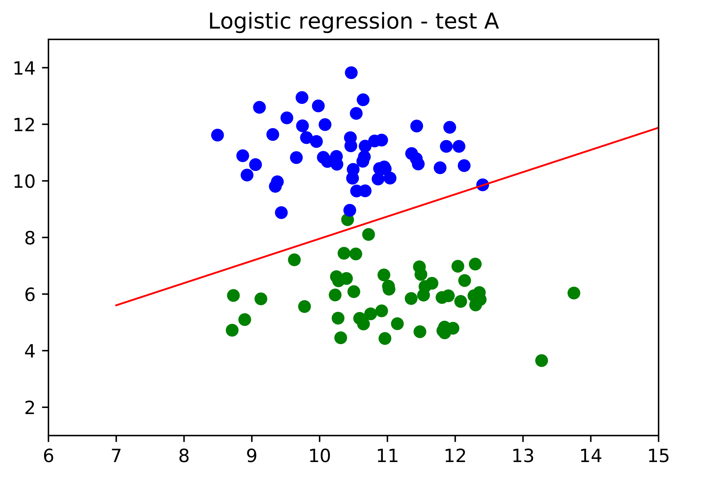
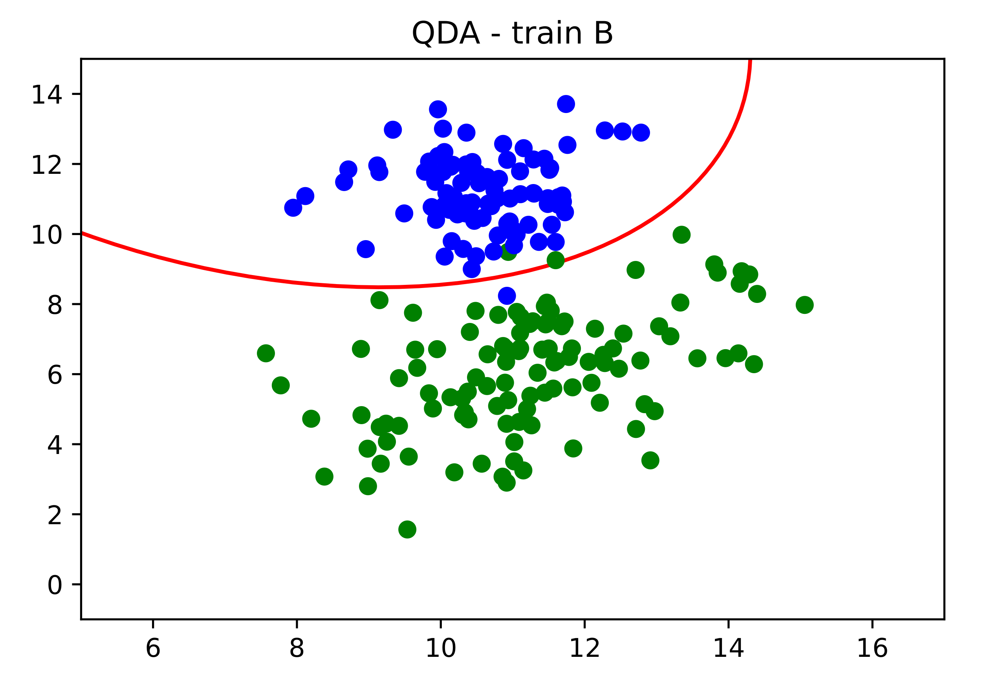

# probabilistic-graphical-models
A part of the coursework for the PGM class, Master MVA, ENS Paris-Saclay

# 1. LDA, logistic regression, linear regression, QDA
* Compared the performance of each model on 3 datasets: A, B and C.

Method | Err. trainA | Err. trainB | Err. trainC | Err. testA | Err. testB | Err. testC 
------------ | ------------- | ----------- | -------------- | -------- | ------- | -------
LDA | 0.0% | 2.0% | 2.67% | 1.0% | 4.5% | 4% 
Logistic regression | 0.0% | 2.0% | 3.33% | 2.0% | 5.0% | 4.33% 
Linear regression | 0.0% | 2.0% | 2.67% | 1.0% | 4.5% | 4.0% 
QDA | 0.0% | 1.5% |  2.67% | 1.0% | 2.5% | 4.33%

### LDA - train

  
   
  

### LDA - test

  
   
  

### Logistic regression - train

  
   
  

### Logistic regression - test

  
   
  

### Linear regression - train

  
   
  

### Linear regression - test

  
   
  

### QDA - train

  
   
  

### QDA - test

  
   
  

